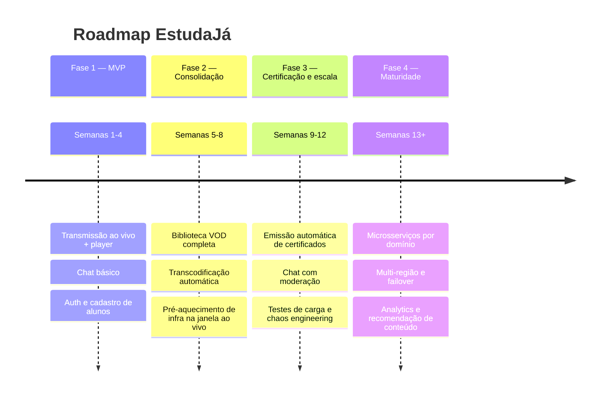
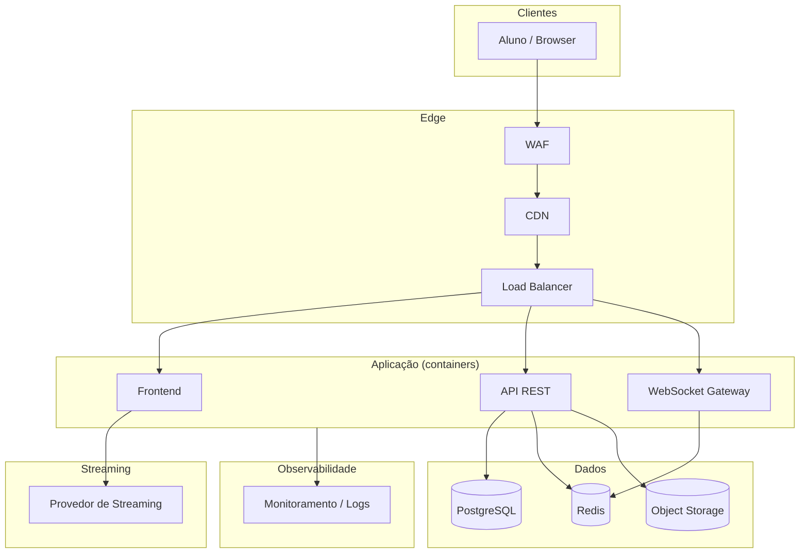
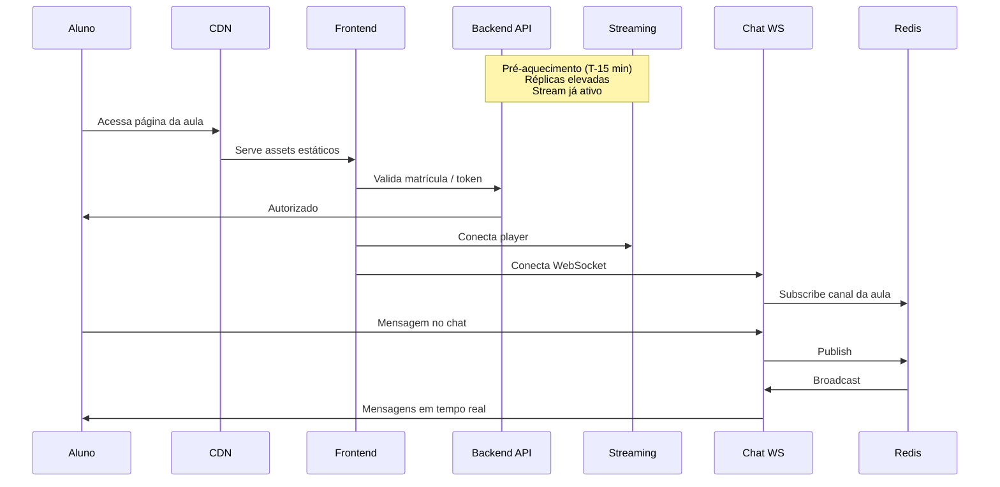

# EstudaJá — Plataforma de Cursos ao Vivo

## Integrantes

- Gustavo Santos Arruda
- Pedro Lucas dos Santos Ribeiro
- Renan Roseno dos Santos
- Victor da Silva Neves

---

## Contexto do negócio

A **EstudaJá** é uma EdTech de aulas ao vivo em massa — estilo "aula magna" — com milhares de alunos simultâneos e conteúdo gravado sob demanda.

**O problema:** a aula começa em horário fixo e o pico de acesso é **instantâneo**. Não dá para escalar aos poucos: ou a plataforma aguenta no minuto zero, ou milhares de alunos ficam de fora.

> *19h. Maria abre o app para a aula de Direito Constitucional. Em segundos, mais 3.000 alunos fazem o mesmo. O player precisa carregar, o chat precisa responder, e nada pode cair — a aula não espera.*

**Escopo do MVP:** transmissão ao vivo, chat da aula, biblioteca básica de vídeos e emissão simples de certificado. Prazo curto — entregamos o essencial primeiro e evoluímos depois.

---

## SLA desejado

| Período | Disponibilidade | Observação |
|---------|-----------------|------------|
| **Durante transmissão ao vivo** | **99,9%** | Janela crítica: início da aula até o encerramento |
| **Fora do horário de transmissão** | **99%** | Biblioteca de vídeos, chat assíncrono, emissão de certificados |

**Implicações operacionais:**

- A infraestrutura de streaming e chat deve estar **pré-aquecida** antes do horário da aula — não há tempo para escalar gradualmente.
- Monitoramento e alertas são obrigatórios na janela de transmissão.
- Fora do pico, tolera-se maior latência de provisionamento e janelas de manutenção planejadas.

---

## Estratégia: MVP e evolução

### MVP (Fase 1 — entrega inicial)

Objetivo: validar o fluxo principal com o menor escopo possível, priorizando estabilidade na janela ao vivo.

| Funcionalidade | Escopo MVP | Fora do MVP |
|----------------|------------|-------------|
| Transmissão ao vivo | Uma aula por vez via provedor de streaming gerenciado | Multi-stream, DVR ao vivo, qualidade adaptativa avançada |
| Chat da aula | Chat em tempo real básico (WebSocket), sem moderação automática | Moderação por IA, filtros, silenciamento em massa |
| Biblioteca de vídeos | Upload manual e playback simples (VOD) | Transcodificação automática, legendas, busca full-text |
| Certificados | Emissão manual ou PDF simples ao concluir curso | Integração com blockchain, verificação pública |
| Autenticação | Login básico (e-mail/senha ou OAuth social) | SSO corporativo, MFA obrigatório |
| Infraestrutura | Containers com orquestração e autoscaling; CDN + streaming gerenciado | Microsserviços completos, multi-região |
| Observabilidade | Logs centralizados + alertas na janela ao vivo | APM, tracing distribuído, dashboards de negócio |
| CI/CD | Pipeline mínimo (build + testes + deploy) | GitOps, ambientes efêmeros, feature flags |

### Plano de evolução pós-MVP

| Fase | Foco | Entregáveis principais |
|------|------|------------------------|
| **2 — Consolidação** | VOD e resiliência | Upload/transcodificação, CDN otimizada, runbooks de incidente |
| **3 — Certificação e escala** | Completude do produto | Certificados automáticos, moderação de chat, testes de carga documentados |
| **4 — Maturidade** | Escala e operação avançada | Decomposição em microsserviços, observabilidade avançada, custo otimizado |

---

## Plano de desenvolvimento

### Visão geral das sprints (MVP — 4 semanas)

| Sprint | Objetivo | Entregas |
|--------|----------|----------|
| **S1** | Fundação | Repositório, CI básico, auth, modelagem de domínio (Curso, Aula, Aluno) |
| **S2** | Ao vivo | Integração com provedor de streaming, player embed, página da aula |
| **S3** | Interação | Chat WebSocket, presença online, testes de carga na janela simulada |
| **S4** | Estabilização | Monitoramento, alertas SLA, documentação, demo para apresentação |

### Riscos e mitigações

| Risco | Impacto | Mitigação |
|-------|---------|-----------|
| Pico instantâneo na abertura da aula | Indisponibilidade | Pré-aquecimento de containers; CDN; load test antes do go-live |
| Latência do chat com milhares de usuários | Experiência ruim | Redis Pub/Sub + WebSocket gateway ou serviço SaaS de tempo real |
| Cold start de containers | Atraso no início da aula | Autoscaling com réplicas mínimas elevadas na janela; scaling programado |
| Custo de streaming | Orçamento | Serviço pay-per-use; gravar e servir VOD via CDN após a live |

### Critérios de aceite do MVP

- [ ] Aluno consegue entrar na aula ao vivo no horário agendado
- [ ] Player exibe stream com latência aceitável (< 10 s)
- [ ] Chat funciona com pelo menos 500 usuários simultâneos (simulado)
- [ ] Disponibilidade ≥ 99,9% medida em janela de teste de 1 h
- [ ] Pipeline CI executa build e testes automatizados a cada push

---

## Stack proposta

Cada camada oferece uma opção **gerenciada (AWS)** e uma **self-hosted**, para flexibilidade entre velocidade de entrega e controle de custo.

| Camada | AWS (gerenciado) | Self-hosted | Justificativa |
|--------|------------------|-------------|---------------|
| **Frontend** | Amplify ou S3 + CloudFront | Next.js em container + nginx | SSR, boa DX, deploy estático ou containerizado |
| **Backend API** | ECS Fargate | Docker Compose em VM | API REST + WebSocket para chat |
| **Streaming ao vivo** | AWS IVS | NGINX-RTMP ou Ant Media Server | Escala automática vs. controle total do stream |
| **VOD / armazenamento** | S3 + CloudFront | MinIO + CDN | Vídeos gravados e assets estáticos |
| **Chat em tempo real** | API Gateway WebSocket + Lambda | Socket.io + Redis Pub/Sub | Baixa latência; self-hosted reduz custo no MVP |
| **Banco de dados** | RDS PostgreSQL | PostgreSQL em container/VM | Relacional, ACID para matrículas e progresso |
| **Cache** | ElastiCache Redis | Redis em container/VM | Sessões, pub/sub do chat, rate limiting |
| **Auth** | Cognito | Keycloak ou autenticação própria | OAuth social sem implementar do zero |
| **Orquestração** | **ECS Fargate** + ALB | Docker Compose / Docker Swarm | ECS reduz complexidade e oferece autoscaling nativo |
| **Registry de imagens** | ECR | Docker Hub / registry privado | Imagens versionadas pelo CI |
| **Autoscaling** | ECS Service Auto Scaling + EventBridge | Scripts cron + docker scale | Pré-aquecimento antes da aula |
| **IaC** | Terraform / CloudFormation | Terraform + Ansible | Infra reproduzível e versionada |
| **CI/CD** | GitHub Actions | GitHub Actions / GitLab CI | Build, testes e deploy automatizados |
| **Monitoramento** | CloudWatch + Grafana | Prometheus + Grafana | Métricas SLA na janela ao vivo |
| **Logs** | CloudWatch Logs | Loki ou ELK | Centralização e correlação de incidentes |

### Orquestração e autoscaling (recomendado: ECS)

Para o MVP, recomendamos **ECS com Fargate** — menor complexidade que Kubernetes e autoscaling nativo, ideal para o pico instantâneo.

**Estratégia de autoscaling:**

1. **Scaling programado (T-15 min):** elevar réplicas dos serviços críticos (API e chat) antes do horário da aula.
2. **Target tracking:** escala por CPU, memória ou métricas customizadas (ex.: conexões WebSocket ativas).
3. **Scaling pós-aula:** reduzir réplicas após o encerramento para controlar custo.

### Evolução da stack (Fases 2–4)

- **Microsserviços:** separar auth, chat, catalog e certificate em services independentes
- **Event-driven:** filas (SQS, RabbitMQ ou Kafka) para eventos de presença
- **Serverless:** funções para transcodificação e geração de certificados
- **DevSecOps:** SAST/DAST no pipeline, gestão de secrets, scan de imagens

---

## Arquitetura (MVP)

### Fluxo — início da aula ao vivo (pico instantâneo)

---

## Disciplinas do curso

Disciplinas marcadas são as **mais críticas** para cumprir o SLA e operar a EstudaJá — especialmente o pico instantâneo na abertura das aulas ao vivo.

- [ ] Ecossistemas de Startups
- [ ] Direito Digital e LGPD
- [ ] Fundamentos de Engenharia de Software
- [ ] Metodologias Ágeis em Gestão de Projetos
- [x] Desenvolvimento de Software Integrado – DevOps
- [ ] Design da Experiência do Usuário
- [ ] Controle de Versão e Gerenciamento de Configuração
- [ ] Gerenciamento de Produtos
- [x] Integração e Entrega Contínua
- [x] Orquestração de Contêineres e Gerenciamento de Cluster
- [x] Infraestrutura Automatizada
- [ ] Desenvolvimento de Software Seguro – DevSecOps
- [ ] Testes Automatizados e Contínuos
- [x] Arquitetura de Microsserviços e Escalabilidade
- [ ] Documentação Técnica
- [ ] Computação em Nuvem
- [ ] Computação sem Servidores
- [x] Monitoramento e Análise de Logs
- [ ] Tópicos Avançados em Engenharia de Software

---

## Apresentação (referência)

- Tempo máximo: **20 minutos**
- Conteúdo sugerido: problema (pico instantâneo) → MVP → arquitetura → SLA → disciplinas críticas → demo (quando houver código)

---

## Próximos passos (fora deste documento)

Estes itens constam em [REQUISITOS.md](./REQUISITOS.md) como entregáveis futuros do projeto:

- [ ] Repositório configurado (GitHub/GitLab/Bitbucket)
- [ ] Estrutura de pipelines inicial (CI)

---

## Referências

- [DESCRICAO.md](./DESCRICAO.md) — enunciado do projeto
- [REQUISITOS.md](./REQUISITOS.md) — entregáveis e disciplinas do curso
