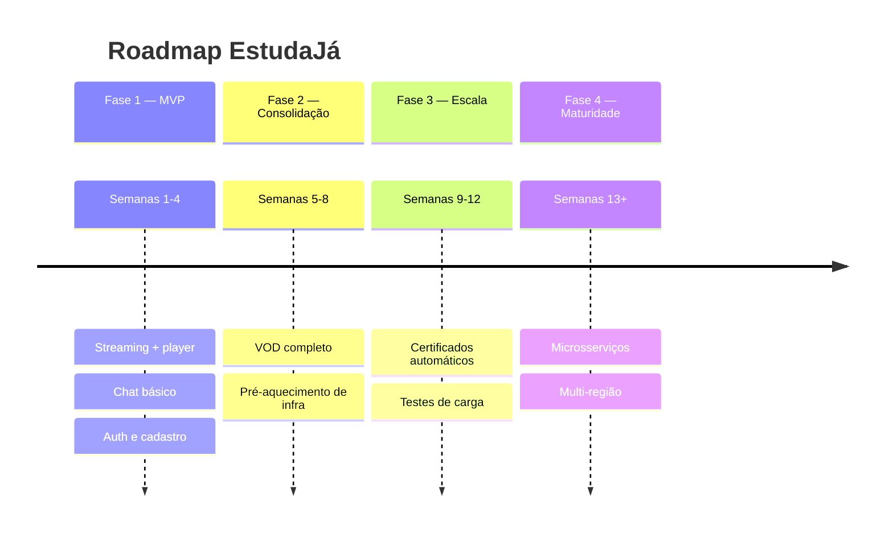
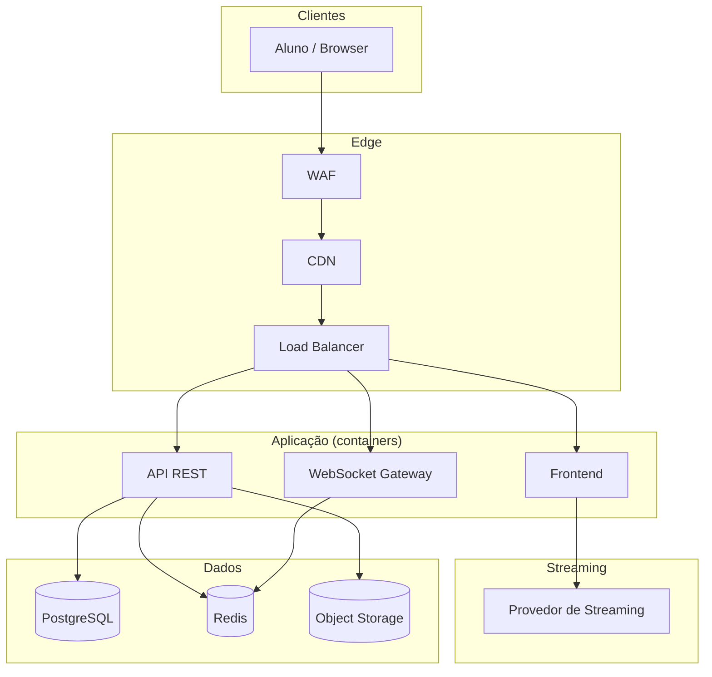
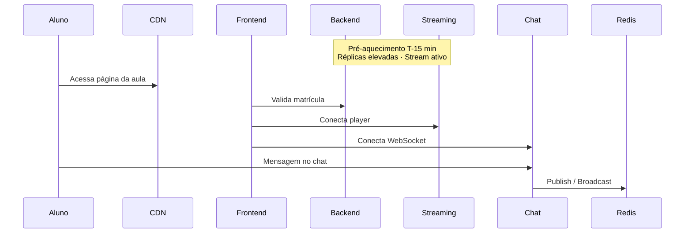

<!-- _class: lead -->

# EstudaJá

## Plataforma de Cursos ao Vivo

EdTech · Aula magna · Milhares de alunos simultâneos

---

## Contexto

A **EstudaJá** oferece aulas ao vivo em massa e conteúdo gravado sob demanda.

**O problema:** a aula começa em horário fixo e o pico de acesso é **instantâneo**.

Não dá para escalar aos poucos — ou a plataforma aguenta no minuto zero, ou milhares de alunos ficam de fora.

> *19h. Maria abre o app para a aula de Direito Constitucional. Em segundos, mais 3.000 alunos fazem o mesmo. O player precisa carregar, o chat precisa responder, e nada pode cair — a aula não espera.*

---

## SLA desejado

| Período | Disponibilidade |
|---------|-----------------|
| **Durante transmissão ao vivo** | **99,9%** |
| **Fora do horário de transmissão** | **99%** |

**Implicações:**

- Infraestrutura **pré-aquecida** antes da aula
- Monitoramento e alertas na janela crítica
- Fora do pico: tolera-se manutenção planejada

---

## Escopo do MVP

Entregar o essencial no prazo curto — evoluir depois.

| Funcionalidade | MVP |
|----------------|-----|
| Transmissão ao vivo | Uma aula por vez via streaming gerenciado |
| Chat | WebSocket básico, sem moderação automática |
| Biblioteca VOD | Upload manual e playback simples |
| Certificados | PDF simples ao concluir curso |
| Auth | Login básico (e-mail/senha ou OAuth) |
| Infra | Containers + autoscaling + CDN |

---

## Roadmap

---

## Plano de desenvolvimento — 4 sprints

| Sprint | Objetivo | Entregas |
|--------|----------|----------|
| **S1** | Fundação | Repo, CI, auth, domínio (Curso, Aula, Aluno) |
| **S2** | Ao vivo | Streaming, player, página da aula |
| **S3** | Interação | Chat WebSocket, testes de carga simulados |
| **S4** | Estabilização | Monitoramento, alertas SLA, demo |

---

## Arquitetura MVP

---

## Fluxo — pico instantâneo

---

## Stack proposta

Cada camada: opção **AWS (gerenciado)** ou **self-hosted**

| Camada | AWS | Self-hosted |
|--------|-----|-------------|
| Frontend | Amplify / CloudFront | Next.js + nginx |
| Backend | ECS Fargate | Docker Compose |
| Streaming | AWS IVS | NGINX-RTMP |
| Banco | RDS PostgreSQL | PostgreSQL em VM |
| Cache | ElastiCache Redis | Redis em VM |
| Orquestração | **ECS Fargate + ALB** | Docker Compose |

---

## Autoscaling (ECS)

Recomendado para o pico instantâneo — menor complexidade que Kubernetes.

1. **T-15 min:** elevar réplicas de API e chat antes da aula
2. **Target tracking:** escala por CPU, memória ou conexões WebSocket
3. **Pós-aula:** reduzir réplicas para controlar custo

---

## Riscos e mitigações

| Risco | Mitigação |
|-------|-----------|
| Pico instantâneo | Pré-aquecimento de containers + CDN + load test |
| Latência do chat | Redis Pub/Sub + WebSocket ou SaaS de tempo real |
| Cold start | Autoscaling com réplicas mínimas elevadas na janela |
| Custo de streaming | Pay-per-use; VOD via CDN após a live |

---

## Disciplinas mais críticas

- [x] Desenvolvimento de Software Integrado – **DevOps**
- [x] Integração e Entrega **Contínua**
- [x] Orquestração de **Contêineres**
- [x] **Infraestrutura** Automatizada
- [x] Arquitetura de **Microsserviços** e Escalabilidade
- [x] **Monitoramento** e Análise de Logs

*Demais 13 disciplinas do curso complementam o projeto.*

---

## Critérios de aceite do MVP

- [ ] Aluno entra na aula ao vivo no horário agendado
- [ ] Player com latência aceitável (< 10 s)
- [ ] Chat com 500+ usuários simultâneos (simulado)
- [ ] Disponibilidade ≥ 99,9% em janela de teste de 1 h
- [ ] Pipeline CI com build e testes a cada push

---

<!-- _class: lead -->

# Próximos passos

Repositório remoto · Pipeline CI · Implementação do MVP

**Obrigado!**
