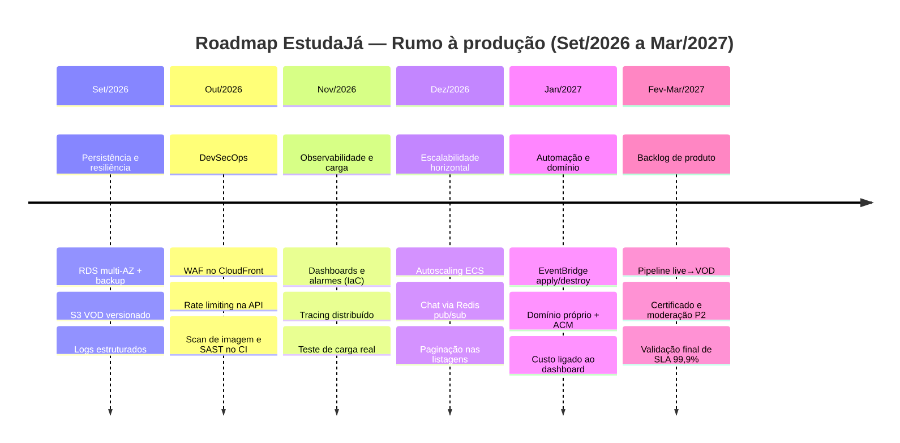

<!--
  Diagrama de arquitetura (referência, fora dos slides):
  slides/diagrams/arquitetura-atual.mmd → npm run slides:diagrams:atual
  Roadmap 6 meses: slides/diagrams/roadmap-projecao.mmd
-->

<!-- _class: lead -->

# EstudaJá

## Da aula magna à arquitetura entregue

Live · Chat · VOD · Demo AWS efêmera

Gustavo Santos Arruda · Pedro Lucas dos Santos Ribeiro · Renan Roseno dos Santos · Victor da Silva Neves

---

## Contexto

A **EstudaJá** é uma EdTech de aulas ao vivo em massa — estilo **aula magna** — com milhares de alunos simultâneos e conteúdo gravado sob demanda.

**O problema:** a aula começa em horário fixo e o pico de acesso é **instantâneo**. Não dá para escalar aos poucos — ou a plataforma aguenta no minuto zero, ou milhares de alunos ficam de fora.

> *19h. Maria abre a ficha da aula de Direito Constitucional. Em segundos, mais 3.000 alunos fazem o mesmo. O player de live precisa carregar, o chat precisa responder, e quem perdeu o horário ainda precisa revisar a gravação — tudo na mesma tela, sem a aula esperar.*

**SLA alvo:** 99,9% na janela ao vivo · 99% fora dela.

---

## Arquitetura implementada

Stack monolítica pragmática — uma API, uma task ECS na demo, destroy entre sessões.

| Camada | Tecnologia |
|--------|------------|
| **Frontend** | Vite + React + TypeScript · S3 + CloudFront |
| **API** | Go + Fiber · JWT + bcrypt · RBAC (`admin`, `professor`, `aluno`) |
| **Banco** | PostgreSQL (GORM + migrations) · RDS `db.t4g.micro` na AWS |
| **Live** | AWS IVS (canal BASIC LOW) · stub local/CI · player IVS na ficha |
| **Chat** | WebSocket na mesma API · hub in-memory por `aula_id` · ALB `idle_timeout=3600` |
| **VOD** | MP4 por aula · disco local (dev) ou S3 privado + URL pré-assinada (~15 min) |
| **Infra** | Terraform flat · ECS Fargate ARM64 · ALB · ECR · SSM · budget separado |
| **CI/CD** | GitHub Actions (test + build + Docker) · CD opcional para publish na demo |

---

<!-- _class: features -->

## Features — 3 essenciais

*Tudo na mesma página da aula.*

### 🥇 Transmissão ao vivo em massa

Milhares de alunos entram juntos no horário da aula e assistem sem a plataforma “travar” na abertura.

### 🥈 Chat em tempo real da aula

A turma participa durante a live — pergunta, reage e o professor sente presença, não só audiência.

### 🥉 Biblioteca de gravações (VOD)

Quem perdeu o horário ou quer revisar assiste à aula gravada depois, no mesmo lugar.

### Reservas — entregues, fora do top 3

- **Certificado de conclusão** — importante ao fim do curso, mas não destrava a experiência da aula ao vivo
- **Catálogo e agenda** — base do produto; o diferencial está na live, no chat e na gravação

---

<!-- _class: features-fatias -->

## Features — fatias de entrega

Cada fatia entrega valor real ao usuário — não só “mais uma camada técnica”.

### 🥇 Live

1. Professor **liga e desliga** a transmissão; aluno vê se a aula está ao vivo
2. **Transmissão de verdade:** professor envia o sinal e a turma assiste pela plataforma
3. **Agenda da aula:** marcar horário; estados agendada, ao vivo ou encerrada

### 🥈 Chat

1. Alunos e professor **conversam na mesma tela** da aula, em tempo real
2. Cada aula tem **sua própria sala**; mensagens curtas; nada vaza para outra turma
3. **Na plataforma publicada:** turma acessa pelo link da demo e conversa durante a aula ao vivo — mesma experiência do local, com conexão estável do início ao fim

### 🥉 VOD

1. Aluno **assiste à gravação** na mesma página (live e gravação separados)
2. Professor **publica, troca ou remove** o vídeo da aula
3. Gravações na **plataforma em produção**, com acesso controlado

---

<!-- _class: adrs -->

## ADR 0001 — Transmissão ao vivo

### Escolha

- **AWS IVS** `BASIC` + latência `LOW` · 1 canal/sessão (`infra/ivs.tf`)
- `LIVE_BACKEND=stub|ivs` · estados em `AulaLive` · Amazon IVS Player no frontend

### Alternativas descartadas

NGINX-RTMP self-hosted · IVS STANDARD/ADVANCED · canal IVS por aula · IVS Real-Time · `<video src=".m3u8">`

### ✅ Positivos · ⚠️ Negativos aceitos

- Pico T−0 gerenciado; canal ocioso ≈ $0; RBAC testável no CI com `stub`
- `authorized=false` — HLS interceptável · 1 live por vez · stub sem vídeo real

---

<!-- _class: adrs -->

## ADR 0002 — Chat da aula

### Escolha

- **WebSocket Fiber** na task ECS · `GET /aulas/:id/chat/ws?token=`
- Hub in-memory (`internal/chat`) · ALB `idle_timeout=3600` · ping/pong a cada 2 min

### Alternativas descartadas

API Gateway WS + Lambda · Redis/ElastiCache · IVS Chat · persistência PostgreSQL

### ✅ Positivos · ⚠️ Negativos aceitos

- Mesmo binário local/AWS; custo marginal ≈ 0; sala por `aula_id`; independente da live
- `desired_count=1` — sem fan-out entre réplicas · sem histórico · JWT na query string

---

<!-- _class: adrs -->

## ADR 0003 — Gravações (VOD)

### Escolha

- **S3 privado** (`s3_vod.tf`) · chave `vod/aulas/{id}/current.mp4`
- Upload multipart via API · presigned GetObject TTL 15 min · `VOD_BACKEND=local|s3`

### Alternativas descartadas

CloudFront + OAC · MinIO · proxy na API Fargate · presigned PUT browser→S3 · bucket do SPA

### ✅ Positivos · ⚠️ Negativos aceitos

- Bucket efêmero com destroy; MP4 ≤50 MB + magic `ftyp`; seed `003_seed_vod_demo`
- Sem CDN de mídia · URL reusável no TTL · sem transcodificação/ffprobe

---

<!-- _class: compact -->

## Pipeline — garantindo as ADRs

**CI em todo push/PR** (`.github/workflows/ci.yml`):

- `go test ./...` — auth/RBAC, estados da live (`stub`), chat WS (isolamento, 500 chars), VOD, handlers
- `npm test` + `npm run build` — UI da ficha (live, chat, gravação)
- Build das imagens Docker API + frontend

**CD opcional P3** (`.github/workflows/cd.yml`) — só com `AWS_CD_ENABLED=true`:

- Quality gate: testes + build **antes** de publicar (vermelho não promove)
- API `linux/arm64` → ECR → ECS force deploy
- Frontend com `VITE_API_URL` da sessão → S3 sync → invalidate CloudFront

**IaC + runbook:** Terraform provisiona IVS, S3 VOD, ECS, RDS; scripts `publish-*.ps1` e warm-up T−15 fecham o caminho das três ADRs na demo.

---

<!-- _class: evolucao -->

## Evolução — próximos 6 meses

---

<!-- _class: lead -->

# Obrigado!

Repositório · Demo AWS · ADRs em `docs/entregaveis/`

**EstudaJá** — a aula não espera.
