# Usar AWS IVS para a transmissão ao vivo da aula magna

| Campo | Valor |
| --- | --- |
| Status | Aceita |
| Data | 2026-09-05 |
| Decisores | Gustavo Santos Arruda, Pedro Lucas dos Santos Ribeiro, Renan Roseno dos Santos, Victor da Silva Neves |
| Feature | Transmissão ao vivo em massa (aula magna) |
| Tags | live, ivs, stub, demo-aws |

## Contexto e problema

A aula magna tem horário fixo. Os acessos concentram-se no mesmo minuto (T−0). Se a transmissão não estiver pronta nessa abertura, perde-se o momento principal da aula: não dá para “escalar aos poucos” depois que ela começou.

O produto precisa de um caminho ponta a ponta em que professor ou admin agenda, inicia e encerra a live na ficha da aula (`/aulas/:id`), e o aluno autenticado assiste no player da mesma tela. Ao mesmo tempo, o time precisa desenvolver e testar estados e permissões **sem** depender de vídeo real no ambiente local nem no CI.

A tabela histórica da apresentação ainda listava NGINX-RTMP (self-hosted) como alternativa de streaming. A demo acadêmica, porém, segue o caminho AWS gerenciado, com ciclo `apply` → demo → `destroy` entre sessões, sem NAT Gateway e sem serviços pagos ociosos 24/7.

## Critérios de decisão

Qualquer opção precisava:

- Estar pronta **antes** do horário marcado (warm-up T−15, não cold start em T−0).
- Atender o SLA alvo de **99,9%** na janela ao vivo, na medida do MVP.
- Caber no orçamento da conta acadêmica e sumir com o `terraform destroy`.
- Permitir um único sinal real na demo (OBS → um canal), com no máximo uma aula ao vivo por vez.
- Ser testável no Compose/CI **sem** fingir que existe vídeo.
- Não misturar o estado da transmissão com o status cadastral da aula, nem converter a live em VOD automaticamente.

## Opções consideradas

1. **Servidor de streaming self-hosted (NGINX-RTMP / equivalente)** — mais controle, mas a equipe opera encoder, escala e falhas no minuto do pico. Fora do caminho obrigatório da demo (AWS gerenciado).
2. **AWS IVS tipo STANDARD ou ADVANCED** — transcodificação e qualidade adaptativa; input bem mais caro; desnecessário para uma demo com dezenas de avaliadores.
3. **Um canal IVS por aula** — lives simultâneas e isolamento extra; custo e complexidade rejeitados na clarificação da spec (um canal compartilhado da sessão).
4. **IVS Real-Time (Stages)** — outro produto e outro preço; não é o caminho de low-latency já adotado no README.
5. **Reproduzir o HLS da live com `<video src=".m3u8">`** — Chrome sem HLS nativo e latência pior; a documentação do IVS exige o player oficial para baixa latência.
6. **AWS IVS BASIC LOW-latency + backend `stub` no local/CI** (escolhida).

## Decisão

Na demo AWS usamos **um** canal [Amazon Interactive Video Service (IVS)](https://docs.aws.amazon.com/ivs/) por sessão Terraform, em `us-east-1`: tipo **BASIC**, latência **LOW**, playback **não** autorizado (`authorized = false`) e **sem** configuração de gravação (a live não vira MP4 sozinha).

O professor ou admin inicia a live na ficha, obtém servidor e stream key, e envia o sinal pelo **OBS**. O aluno autenticado recebe a URL de playback só pela API (JWT + leitura de aulas) e só enquanto aquela aula está `ao_vivo`. O frontend usa o **Amazon IVS Player** (SDK via CDN), separado do player de VOD (`<video>` de MP4).

No Compose e no CI, `LIVE_BACKEND=stub` (default). Iniciar/encerrar, RBAC e erros em português funcionam; **não** há vídeo real nem credenciais de ingestão. Na task ECS da demo, `LIVE_BACKEND=ivs` com as variáveis `IVS_*` injetadas; se o modo `ivs` estiver incompleto, a API **não** marca a aula como ao vivo (fail-fast no boot).

O estado da transmissão vive em `AulaLive` (`agendada` \| `ao_vivo` \| `encerrada`; ausência = `inativa`). Isso **não** é o `Aula.Status` do CRUD. Encerrar permite iniciar de novo na mesma sessão, sem novo `apply`; a stream key permanece até o `destroy`. No máximo **uma** aula `ao_vivo` por vez.

## Consequências

**Positivas**

- O pico de T−0 usa um serviço gerenciado de baixa latência, sem a equipe operar um servidor de stream.
- Canal ocioso (sem ingest e sem viewers) praticamente não gera cobrança de IVS; o `destroy` remove o canal.
- Local e CI validam o fluxo pedagógico (quem liga, quem assiste, uma live por vez) sem conta AWS.
- Live e VOD permanecem blocos distintos na mesma ficha.

**Negativas / aceitas de propósito**

- Quem interceptar a URL HLS pode reproduzir fora do app até o destroy (canal não autorizado). Tokenização de playback IVS ficou fora do P1; o portão de produto é o JWT na API.
- Um canal compartilhado: não há lives simultâneas nem ABR.
- Stub não demonstra imagem; a prova de vídeo só existe na sessão AWS com OBS.

**Fora desta decisão (e do P1)**

- DVR, múltiplos canais, pipeline live→VOD, IVS Chat, domínio customizado.

## Como conferir no código

- Canal: [`infra/ivs.tf`](../../../infra/ivs.tf) (`BASIC`, `LOW`, `authorized = false`).
- Dual backend: `LIVE_BACKEND` em [`backend/internal/config/config.go`](../../../backend/internal/config/config.go); fail-fast em [`backend/cmd/api/main.go`](../../../backend/cmd/api/main.go).
- Estados: [`backend/internal/models/aula_live.go`](../../../backend/internal/models/aula_live.go) e [`backend/internal/handler/live_handler.go`](../../../backend/internal/handler/live_handler.go).
- Player: [`frontend/src/components/LivePlayer.tsx`](../../../frontend/src/components/LivePlayer.tsx) (IVS Player na AWS; mensagem em português no stub).

## Mais informações

- Problema e MVP da feature: [`docs/entregaveis/template-features.md`](../template-features.md) (Feature 1).
- Spec e research: [`specs/003-live-streaming-ivs/spec.md`](../../../specs/003-live-streaming-ivs/spec.md), [`research.md`](../../../specs/003-live-streaming-ivs/research.md).
- Operação (OBS, warm-up T−15): [`specs/003-live-streaming-ivs/quickstart.md`](../../../specs/003-live-streaming-ivs/quickstart.md).
- Contrato de ambiente: [`specs/003-live-streaming-ivs/contracts/live-env.md`](../../../specs/003-live-streaming-ivs/contracts/live-env.md).
- Runbook da demo: seção Demo AWS em [`README.md`](../../../README.md).
