# Usar S3 privado e URL temporária para a gravação da aula (VOD)

| Campo | Valor |
| --- | --- |
| Status | Aceita |
| Data | 2026-09-04 |
| Decisores | Gustavo Santos Arruda, Pedro Lucas dos Santos Ribeiro, Renan Roseno dos Santos, Victor da Silva Neves |
| Feature | Biblioteca de gravações (VOD) |
| Tags | vod, s3, playback, demo-aws |

## Contexto e problema

Quem perdeu o horário fixo ou quer revisar não tem segunda chance. Sem o gravado, o valor do curso morre quando a live acaba. A meta fora da janela ao vivo é **99%** de disponibilidade — continuidade de acesso, não o pico de T−0.

O MVP é **um MP4 publicado por aula**, reproduzido na própria ficha (`/aulas/:id`), sem página “Biblioteca” e sem download. Professor ou admin envia, substitui ou remove; o aluno só assiste. Live e VOD são blocos separados: **a live não gera o MP4**.

A apresentação ainda listava MinIO + CDN (self-hosted) e S3 + CloudFront de mídia (AWS). A demo já tem CloudFront só para o site e para a API; um CDN extra de vídeo seria recurso contínuo na sessão, sem ganho obrigatório para clipes curtos e dezenas de espectadores. O ciclo continua `apply` → demo → `destroy` (bucket some com a stack).

## Critérios de decisão

Qualquer opção precisava:

- Um vídeo vigente por aula; novo envio substitui o anterior e apaga o arquivo antigo na hora.
- Reprodução in-app após JWT; o endereço interno de armazenamento não fica público permanente.
- Acesso ao arquivo com validade da ordem de **~15 minutos**, depois nova autorização.
- Teto de **50 MB**, só MP4; seed reproduzível (`003_seed_vod_demo`) sem upload manual.
- Mesmo contrato local e AWS (`playback_url` + `expires_at`), com destroy zerando custo de armazenamento.
- Não reabrir a stack 001 (sem NAT, sem Redis AWS) nem criar CloudFront de mídia no P1.

## Opções consideradas

1. **CloudFront + OAC + URLs assinadas de mídia** — melhor cache/CDN; chave RSA, distribution extra e custo/ops a mais. Adiado: clipes curtos na demo não exigem.
2. **MinIO (self-hosted) como destino da demo** — válido em desenvolvimento, mas a demo acadêmica é AWS gerenciado.
3. **Proxy permanente dos bytes pela API na AWS** — simples, porém carrega a task Fargate (256 CPU / 512 MiB) em toda reprodução. No local, a API **pode** servir o arquivo; na AWS, não é o caminho feliz.
4. **Presigned PUT do browser direto no S3** — escala melhor, mas exige CORS de escrita, confirmação pós-upload e dois caminhos (local ≠ AWS). Rejeitado no P1.
5. **Reusar o bucket do frontend com prefixo `vod/`** — acopla sync do SPA e mídia; risco de o CloudFront do site servir vídeo se a permissão escapar.
6. **Bucket S3 privado efêmero + URL GetObject pré-assinada; disco local no Compose** (escolhida).

## Decisão

Cada aula tem no máximo um objeto vigente, com chave estável:

```text
vod/aulas/{aula_id}/current.mp4
```

O upload entra **pela API** (`multipart/form-data`). A API valida tamanho (≤ 50 MB), MIME/extensão MP4 e magic ISO BMFF (`ftyp`) **antes** de marcar publicado. Não há ffprobe na imagem.

O armazenamento troca por ambiente:

| Ambiente | `VOD_BACKEND` | Onde fica o arquivo | Como o aluno reproduz |
| --- | --- | --- | --- |
| Compose / local | `local` (default) | Disco (`VOD_LOCAL_DIR`, ex. `./data/vod`) | `GET /api/v1/aulas/:id/vod/content?token=...` (token de curta duração) |
| Demo AWS | `s3` | Bucket privado da sessão (`infra/s3_vod.tf`), distinto do frontend | URL **pré-assinada** S3 GetObject, TTL default **15 minutos** (`VOD_PLAYBACK_TTL`) |

Nos dois casos a API autenticada responde JSON `{ "playback_url", "expires_at" }`. O player da ficha é `<video>` nativo de MP4 — **não** o IVS Player da live.

O bucket VOD é privado (block public access, SSE AES256, `force_destroy = true`). CORS só permite GET/HEAD a partir do CloudFront do frontend, para o `<video>` no browser. Não há distribution de mídia. O `destroy` remove bucket e objetos; um `apply` limpo + seed `003_seed_vod_demo` repõe o clipe da aula de exemplo (`backend/assets/vod/demo-aula.mp4`).



## Consequências

**Positivas**

- Quem perdeu a live revisa na mesma ficha, sem página paralela e sem pipeline live→VOD.
- Custo de armazenamento da sessão é irrisório (poucos MB); após destroy, ≈ 0.
- Mesmo fluxo pedagógico local e AWS; o seed evita depender de upload na primeira demo.
- Substituição e remoção apagam o objeto antigo na hora (sem lixo cobrável até o destroy).

**Negativas / aceitas de propósito**

- Sem CDN de mídia: o browser baixa do S3 (AWS) ou da API (local). Suficiente para a demo; não é entrega de milhares de viewers em VOD.
- URL pré-assinada pode ser reusada por ~15 min se vazada; mitigação: JWT para *obter* a URL, TTL curto, bucket privado, sessão efêmera. Sem botão de download no produto.
- Sem transcodificação: arquivo inválido que passe magic+MIME pode falhar no browser (mensagem em português na UI).

**Fora desta decisão (e do P1)**

- Live→VOD automático, legendas, busca no conteúdo, DRM, download, CloudFront de mídia, página/rota “Biblioteca”, rascunho/título/duração (P2 da feature 002).

## Como conferir no código

- Storage local/S3 e chave `current.mp4`: [`backend/internal/vodstorage/`](../../../backend/internal/vodstorage/) (`factory.go`, `local.go`, `s3.go`, `storage.go`).
- Playback e content token: [`backend/internal/handler/vod_handler.go`](../../../backend/internal/handler/vod_handler.go).
- Validação 50 MB / MP4: [`backend/internal/vodstorage/validate.go`](../../../backend/internal/vodstorage/validate.go).
- Bucket: [`infra/s3_vod.tf`](../../../infra/s3_vod.tf).
- Seed: migration `003_seed_vod_demo` em [`backend/internal/database/migrations/migrations.go`](../../../backend/internal/database/migrations/migrations.go); asset [`backend/assets/vod/`](../../../backend/assets/vod/).

## Mais informações

- Problema e MVP da feature: [`docs/entregaveis/template-features.md`](../template-features.md) (Feature 3).
- Spec e research: [`specs/002-vod-library/spec.md`](../../../specs/002-vod-library/spec.md), [`research.md`](../../../specs/002-vod-library/research.md).
- Ambiente: [`specs/002-vod-library/contracts/vod-env.md`](../../../specs/002-vod-library/contracts/vod-env.md).
- Operação na demo: [`specs/002-vod-library/quickstart.md`](../../../specs/002-vod-library/quickstart.md).
- Runbook: seção Demo AWS em [`README.md`](../../../README.md) (bucket VOD efêmero, sem CloudFront de mídia).
